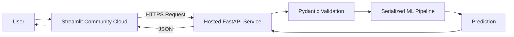

# AnalystLab: End-to-End Machine Learning Microservice

An end-to-end machine learning application that turns two traditional data science problems into deployable prediction services.

AnalystLab combines **machine learning pipelines, feature engineering, model selection, a typed REST API, serialized models, and an interactive Streamlit interface** into a decoupled application architecture.

The project was developed as the culmination of a 7-week machine learning internship, with an emphasis on moving beyond notebook-based analysis toward a system that can actually serve predictions to users.

---

## What Problem Does This Solve?

Many machine learning projects stop after model training and evaluation. The model may perform well in a notebook, but a user still has no practical way to interact with it.

AnalystLab addresses this gap by taking two common supervised learning problems and turning them into usable prediction services:

### 1. Housing Price Prediction — Regression

**Problem:** Estimate the market value of a residential property from its physical, amenity, and location-related characteristics.

The dataset presents challenges including:

- A heavily skewed target variable
- Large-value property outliers
- Non-uniform feature distributions
- Mixed numerical and categorical variables

The solution combines feature preprocessing with a tuned regression pipeline and target transformation to produce more stable predictions.

### 2. Titanic Survival Prediction — Classification

**Problem:** Estimate whether a passenger would survive the Titanic disaster based on their demographic and travel characteristics.

The dataset requires careful handling of:

- Missing values
- Categorical variables
- Passenger names containing useful demographic information
- Family relationships
- Non-linear interactions between passenger characteristics

Feature engineering was therefore used to expose information that is not directly represented by the raw variables.

---

## Approach

Rather than treating model training as the end of the project, the workflow was designed as an end-to-end machine learning system:

```mermaid
flowchart LR
    A[Raw Data] --> B[Data Analysis]
    B --> C[Feature Engineering]
    C --> D[Preprocessing Pipeline]
    D --> E[Model Selection]
    E --> F[Hyperparameter Tuning]
    F --> G[Model Evaluation]
    G --> H[Champion Model]
    H --> I[Model Serialization]
    I --> J[FastAPI]
    J --> K[Streamlit Interface]
    K --> L[User Prediction]
````

### The workflow

**1. Understand the data**

The datasets were explored to identify distributions, missing values, categorical variables, outliers, and relationships between features and the target.

**2. Engineer meaningful features**

Raw variables were transformed into features that better represent the underlying prediction problem.

For Titanic, this included extracting passenger titles and aggregating family-size information.

For Housing, preprocessing was designed to account for skewed distributions and differences in feature scales.

**3. Build reproducible preprocessing pipelines**

Preprocessing and modelling were encapsulated into machine learning pipelines so that the same transformations applied during training are automatically applied during inference.

**4. Compare and tune models**

Candidate models were evaluated using appropriate metrics and hyperparameter tuning to identify the strongest performing configuration.

**5. Serialize the champion models**

The final pipelines were serialized using `joblib`, allowing the trained models to be loaded directly by the prediction service without retraining.

**6. Expose predictions through an API**

FastAPI provides typed REST endpoints for the trained models. Pydantic schemas enforce the expected input structure before a prediction reaches the model.

**7. Build an interactive prediction workspace**

A Streamlit interface allows users to enter prediction scenarios without interacting directly with the API.

---

# System Architecture

The application uses a decoupled architecture in which the frontend and prediction service are separate components.

```mermaid
flowchart TB
    U[User] --> S[Streamlit Frontend]

    S -->|HTTP POST| A[FastAPI Backend]

    A --> V[Pydantic Validation]

    V --> H{Prediction Route}

    H -->|/predict/housing| HP[Housing Pipeline]
    H -->|/predict/titanic| TP[Titanic Pipeline]

    HP --> HM[Serialized Housing Model]
    TP --> TM[Serialized Titanic Model]

    HM --> HR[Housing Prediction]
    TM --> TR[Titanic Prediction]

    HR --> A
    TR --> A

    A -->|JSON Response| S
    S --> U
```

This separation means the prediction logic is not tied directly to the user interface.

The API can therefore be consumed independently by another frontend, application, or client.

---

# Models

## Housing Price Prediction

**Task:** Regression

**Champion model:** Tuned engineered Linear Regression

The housing pipeline uses:

* Feature preprocessing
* Categorical encoding
* `QuantileTransformer` for selected feature distributions
* `TransformedTargetRegressor`
* Log transformation of the target
* Hyperparameter tuning

The target transformation is particularly important because property prices are strongly skewed and contain high-value observations that can disproportionately influence a conventional regression model.

---

## Titanic Survival Prediction

**Task:** Binary classification

**Champion model:** Tuned engineered XGBoost classifier

The Titanic pipeline incorporates engineered features including:

* Passenger title extracted from `Name`
* Family-size information
* Passenger class
* Sex
* Age
* Fare
* Embarkation point
* Family relationship variables

XGBoost was selected to capture non-linear relationships and interactions between passenger characteristics that are difficult to represent using a simple linear decision boundary.

---

# API

The FastAPI backend exposes typed REST endpoints for both prediction tasks.

| Method | Endpoint           | Purpose                                |
| ------ | ------------------ | -------------------------------------- |
| `GET`  | `/`                | API health check                       |
| `POST` | `/predict/housing` | Generate a housing price prediction    |
| `POST` | `/predict/titanic` | Generate a Titanic survival prediction |

Interactive API documentation is automatically generated by FastAPI and available at:

```text
http://localhost:8000/docs
```

---

## Example: Housing Prediction

### Request

```json
{
  "area": 5000,
  "bedrooms": 3,
  "bathrooms": 2,
  "stories": 2,
  "mainroad": "yes",
  "guestroom": "no",
  "basement": "no",
  "hotwaterheating": "no",
  "airconditioning": "yes",
  "parking": 0,
  "prefarea": "yes",
  "furnishingstatus": "furnished"
}
```

### Response

```json
{
  "prediction": "$6,161,400.68",
  "confidence": null,
  "message": "Housing prediction generated successfully."
}
```

---

## Example: Titanic Prediction

### Request

```json
{
  "Pclass": 3,
  "Name": "Smith, Mr. John",
  "Sex": "male",
  "Age": 30.0,
  "SibSp": 0,
  "Parch": 0,
  "Fare": 15.50,
  "Embarked": "S"
}
```

### Response

```json
{
  "prediction": "Did Not Survive",
  "confidence": 0.868,
  "message": "Titanic prediction generated successfully."
}
```

---

# Technology Stack

### Machine Learning

* Python
* pandas
* NumPy
* scikit-learn
* XGBoost
* SciPy
* statsmodels
* SHAP

### Model Serving

* FastAPI
* Uvicorn
* Pydantic
* REST API
* joblib

### Frontend

* Streamlit
* Custom CSS

### Testing

* pytest

### Architecture

* Decoupled frontend/backend design
* Serialized machine learning pipelines
* Typed API contracts
* Custom MLOps file registry

---

# Project Structure

```text
analystlab/
│
├── api/
│   ├── main.py
│   └── schemas/
│
├── app/
│   └── streamlit_app.py
│
├── models/
│   ├── housing/
│   └── titanic/
│
├── notebooks/
│   ├── housing/
│   └── titanic/
│
├── src/
│   ├── data/
│   ├── features/
│   ├── models/
│   └── utils/
│
├── tests/
│
├── run_app.py
├── requirements.txt
└── README.md
```

> Directory names may differ depending on the current repository structure.

---

# Running Locally

## 1. Clone the repository

```bash
git clone https://github.com/yourusername/analystlab-internship.git
cd analystlab-internship
```

## 2. Create a virtual environment

```bash
python -m venv .venv
```

Activate it:

### Windows

```powershell
.venv\Scripts\activate
```

### macOS / Linux

```bash
source .venv/bin/activate
```

## 3. Install dependencies

```bash
pip install -r requirements.txt
```

## 4. Start the application

The project includes an orchestration script for starting the frontend and backend together:

```bash
python run_app.py
```

The application will expose:

| Service              | URL                          |
| -------------------- | ---------------------------- |
| Streamlit frontend   | `http://localhost:8501`      |
| FastAPI backend      | `http://localhost:8000`      |
| FastAPI Swagger docs | `http://localhost:8000/docs` |

---

# Testing

Run the automated test suite with:

```bash
pytest
```

The tests cover core application behaviour and help verify that changes to the prediction service do not silently break existing functionality.

---

# Deployment Architecture

The application is designed so that the frontend and backend can be deployed independently.



The Streamlit frontend should therefore point to the **public URL of the deployed FastAPI service** rather than `localhost`.

For local development, the API can run on:

```text
http://localhost:8000
```

For deployment, the application should use an environment variable containing the hosted API URL.

Example:

```python
API_URL = os.getenv("API_URL", "http://localhost:8000")
```

This allows the same Streamlit application to work in both local development and production environments without changing the source code.

---

# Key Engineering Decisions

### Decoupling the frontend from the model service

The Streamlit application does not directly contain the API's prediction logic. Instead, it communicates with FastAPI over HTTP.

This makes the model service independently consumable and separates presentation concerns from inference logic.

### Persisting complete pipelines

Rather than serializing only the final estimator, the preprocessing and modelling workflow is preserved as a complete pipeline.

This reduces the risk of training/inference preprocessing discrepancies.

### Typed API contracts

Pydantic schemas validate incoming requests before they reach the prediction layer.

This provides a clear contract between the frontend and backend and produces structured validation errors for malformed requests.

### Feature engineering before model selection

Model performance was not treated as purely an algorithm-selection problem.

The feature representation was improved first, allowing the models to capture more meaningful structure in the underlying data.

---

# What This Project Demonstrates

AnalystLab demonstrates the transition from **exploratory data science to an end-to-end machine learning application**.

The project covers the complete path:


Rather than presenting isolated notebook models, the project demonstrates how a trained model can become a usable software capability.

---

# Future Improvements

Potential next steps include:

* Deploying the FastAPI service independently from the Streamlit frontend
* Adding automated CI/CD
* Containerizing the API with Docker
* Adding model versioning and experiment tracking
* Expanding automated test coverage
* Adding monitoring for API health and prediction behaviour
* Introducing automated model retraining workflows

---

## Author

Built by Theresia Saumu as part of a AnalystLab Africa Data Science internship project, with a focus on applying data science methods within a deployable software architecture.
