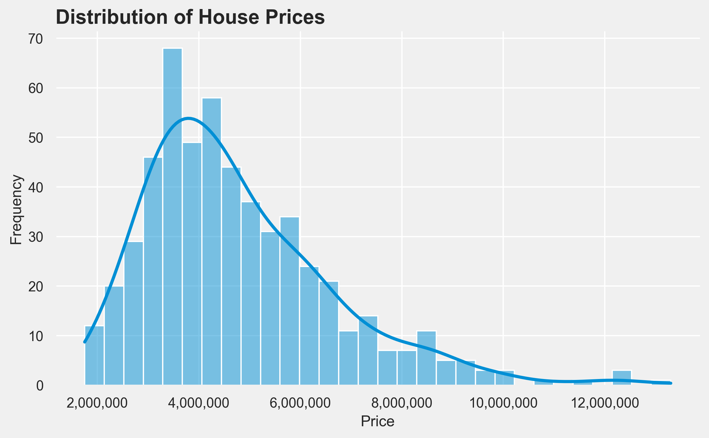
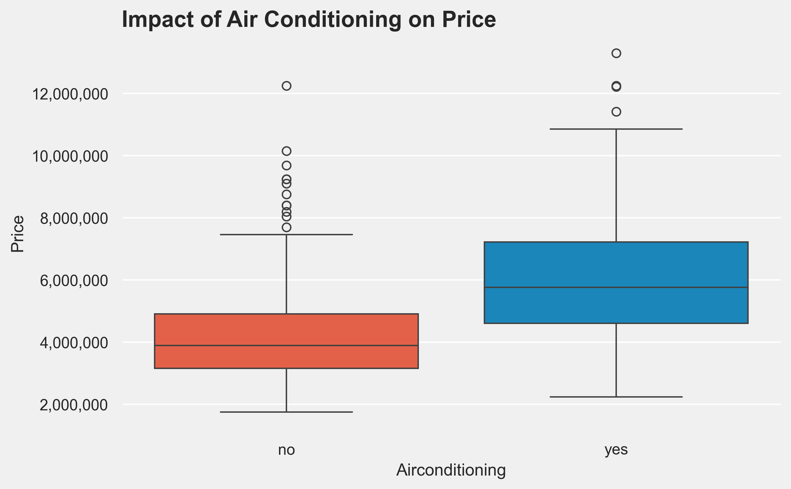
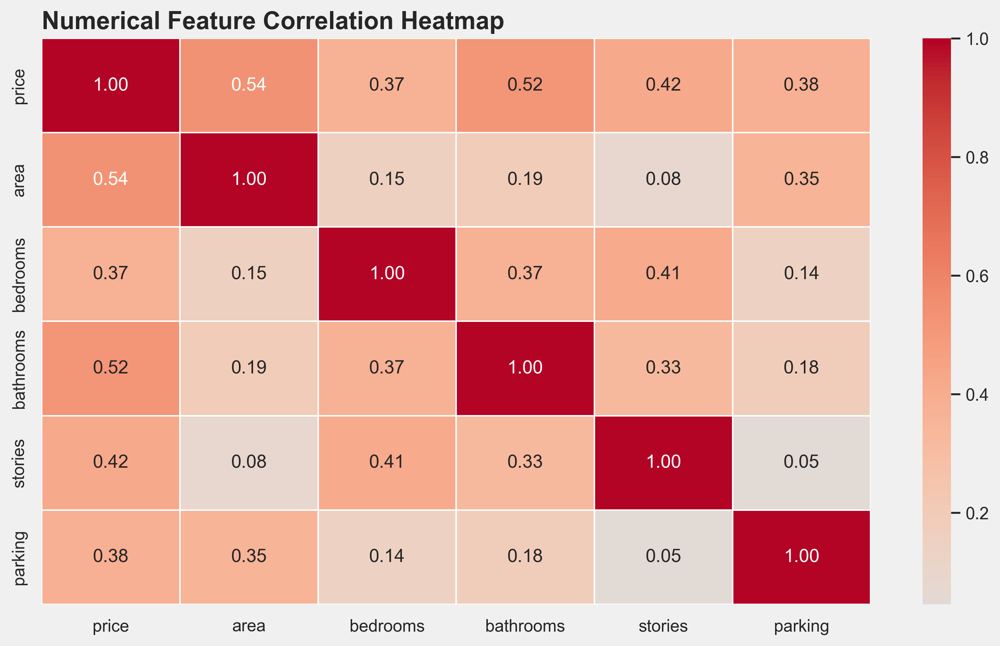
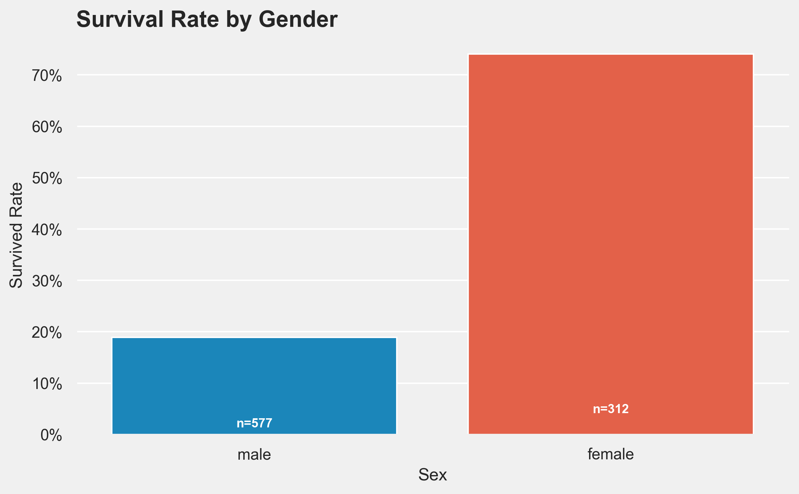
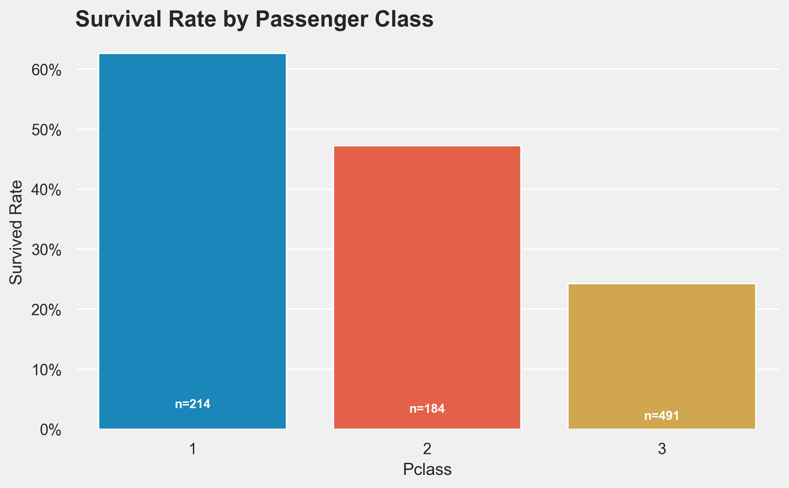
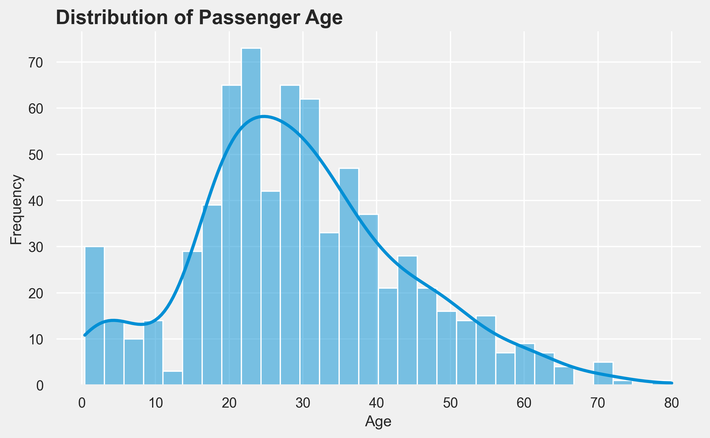

# Week 1-2: Repository Architecture, Cleaning, & EDA

## Objective
Establish a production-grade project architecture, profile two foundational datasets (Titanic and House Prices), execute structural cleaning, and perform Exploratory Data Analysis (EDA) to prepare for machine learning.

## Phase 1 & 2: Architecture & Profiling
A modular `src/` directory was created to handle global configurations, data loading, and visualization, enforcing DRY principles. Custom profiling functions revealed:
- **Titanic:** 891 rows. `Cabin` (77% missing), `Age` (20% missing), and `Embarked` (0.22% missing).
- **Housing:** 545 rows. Zero missing values. Zero duplicates.

## Phase 3: Data Cleaning
- **Housing:** Verified structural integrity; no cleaning required. Passed directly to `processed/`.
- **Titanic:** 
  - Dropped `Cabin` column (excessive nulls).
  - Dropped 2 rows missing `Embarked`.
  - **Architectural Decision:** Deferred `Age` imputation to the Week 4 ML pipeline to strictly prevent **data leakage**.

## Phase 4: Exploratory Data Analysis (EDA)

### Housing Highlights
Both Price and Area are unimodal and heavily right-skewed. Air conditioning and Bathrooms show clear, non-overlapping price demarcations.

### Titanic Highlights
Survival was overwhelmingly dictated by Gender and Class. The Age distribution highlighted a specific survival peak for toddlers (ages 0-5).

## Phase 5: Model Readiness
Both datasets are saved in `datasets/processed/`.
- **Titanic Week 4 Prep:** Requires median imputation for `Age` and One-Hot Encoding for categorical demographics.
- **Housing Week 4 Prep:** Requires binary mapping (Yes/No -> 1/0), One-Hot Encoding, and strict Feature Scaling (Standardization) to handle scale discrepancies between `Area` and room counts.